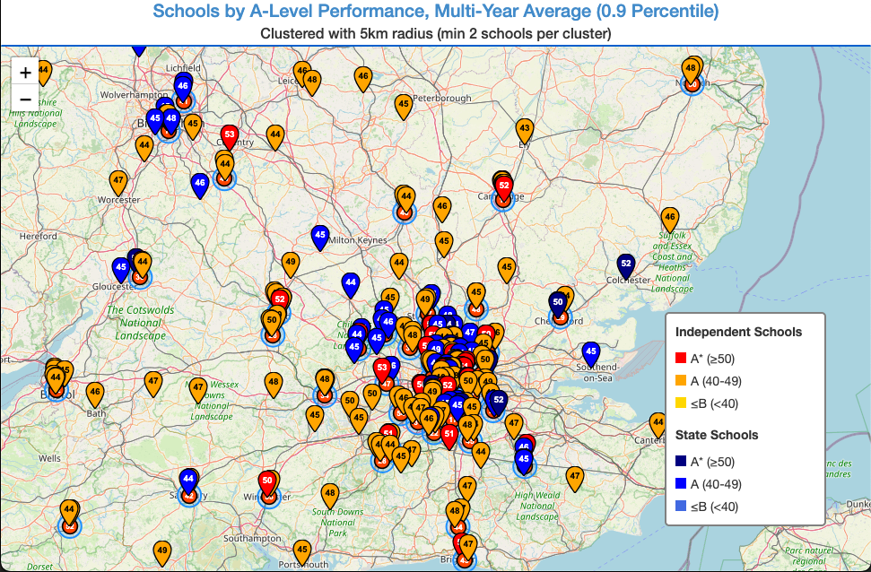

# UK Schools Finder

Interactive map tool for analyzing UK schools by A-level performance and local crime statistics. Generates a standalone web app that works on any device with no server required.

**[Live Demo: Web App →](http://web.andico.org/school_finder.html)**

**[Live Demo: Static Cluster Map →](http://web.andico.org/schools_map.html)**



---

## Quick Start

### 1. Install Dependencies

```bash
pip install pandas boto3 tqdm folium scikit-learn numpy
```

### 2. Download School Data

From https://www.compare-school-performance.service.gov.uk/download-data/:
- Select years 2021-2024
- Select "All of England" → "16-18 results (final)" → CSV format
- Gzip the files:

```bash
gzip 2021-2022_england_ks5final.csv
gzip 2022-2023_england_ks5final.csv
gzip 2023-2024_england_ks5final.csv
```

### 3. Download Crime Data (Optional)

From https://data.police.uk/data/:
- Select "Custom download", choose time period, check "all forces" and "Include crime data"
- Extract and consolidate:

```bash
python3 consolidate_crime_data.py --crime-data-dir /path/to/extracted/data
```

### 4. Configure AWS

```bash
aws configure
```

Create a Place Index in Amazon Location Service and update `config.json`:

```json
{
  "geocoding": {
    "index_name": "your-place-index-name",
    "region_name": "eu-west-2"
  }
}
```

### 5. Generate Outputs

**Option A: Static map + web app**
```bash
python3 plot_schools.py              # 5-15 mins, generates schools_map.html
python3 create_standalone_app.py     # 5 seconds, generates school_finder.html
```

**Option B: Web app only (faster)**
```bash
python3 generate_school_data.py      # 5-15 mins, processes data only
python3 create_standalone_app.py     # 5 seconds, generates school_finder.html
```

### 6. View or Deploy

**Local:**
```bash
open school_finder.html
```

**Deploy to S3:**
```bash
aws s3 cp school_finder.html s3://your-bucket/index.html \
  --content-type "text/html" --acl public-read
```

---

## Architecture

### Scripts

- **`school_data_lib.py`** (~878 lines) - Shared library with all data processing functions
- **`plot_schools.py`** (~724 lines) - Generates static cluster map using Folium
- **`generate_school_data.py`** (~120 lines) - Fast data-only processing (no map)
- **`create_standalone_app.py`** - Builds standalone HTML file with embedded data

### Data Flow

```
School CSVs → Consolidate → Filter by percentile → Geocode (AWS) → Calculate crime stats → Cache
                                                                                              ↓
                                                          plot_schools.py → schools_map.html
                                                                              ↓
                                                          create_standalone_app.py → school_finder.html
```

### Key Features

- **Single source of truth**: All common code in `school_data_lib.py`
- **Smart caching**: Geocoding and crime data cached with SHA256 validation
- **Clean addresses**: NaN values filtered at source during geocoding
- **Fast clustering**: BallTree spatial indexing (O(n log n))
- **Standalone output**: Web app is single HTML file (~450KB)

---

## Outputs

### Static Cluster Map (`schools_map.html`)
- Desktop-focused Folium map
- Shows geographic clusters of high-performing schools
- Configurable radius: `python3 plot_schools.py --radius 10 --min-schools 3`
- Use case: Finding dense areas for home purchases

### Web App (`school_finder.html`)
- Mobile-friendly standalone HTML
- Location-based search (GPS or address)
- 5km radius filtering
- Works offline after initial load
- Use case: On-the-go school searches

---

## Configuration

Edit `config.json` to customize:

```json
{
  "filtering": {
    "percentile": 0.90,           // Top 10% of schools
    "min_age_threshold": 7         // Secondary schools only
  },
  "crime": {
    "school_crime_radius_km": 3,
    "excluded_crime_types": ["Shoplifting", "Bicycle theft", ...]
  },
  "grading": {
    "a_star_threshold": 50,        // TB3PTSE ≥50 = A* grade
    "a_threshold": 40              // TB3PTSE ≥40 = A grade
  }
}
```

**Color Coding:**
- Independent schools: Red (A*), Orange (A), Yellow (≤B)
- State schools: Navy (A*), Blue (A), Light Blue (≤B)

---

## File Structure

```
map_uk_schools/
├── school_data_lib.py             # Shared library
├── plot_schools.py                # Static map generator
├── generate_school_data.py        # Data processor
├── create_standalone_app.py       # Web app generator
├── consolidate_crime_data.py      # Crime data consolidator
├── config.json                    # Settings
│
├── 2021-2022_england_ks5final.csv.gz  # Downloaded data
├── combined_crimes.csv.gz             # Generated crime data
│
├── processed_school_data.csv      # Generated outputs
├── geocoding_cache.json
├── crime_cache.json
├── schools_map.html
└── school_finder.html
```

---

## Updating Data

When new school year data is released:

```bash
gzip 2024-2025_england_ks5final.csv

# Regenerate (existing schools use cached geocoding)
python3 plot_schools.py              # or generate_school_data.py
python3 create_standalone_app.py

# Redeploy
aws s3 cp school_finder.html s3://your-bucket/index.html --acl public-read
```

---

## Technical Details

### Data Sources
- **School Performance**: UK Government (compare-school-performance.service.gov.uk)
  - TB3PTSE: Average of best 3 A-levels
  - TALLPPE_ALEV_1618: Average per A-level
- **Crime Data**: data.police.uk (3km radius, serious crimes only)

### Processing Pipeline
1. Load & consolidate multi-year CSVs
2. Calculate per-school averages across years
3. Filter by percentile (default: top 10%)
4. Clean addresses (remove NaN values)
5. Geocode with AWS Location Services (cached)
6. Calculate crime statistics (cached with SHA256 validation)
7. Save processed data and caches

### Caching
- **Geocoding**: Never invalidated (addresses don't change), saves ~$0.004/lookup
- **Crime**: Invalidated on data/config changes, ~100x speedup on hits

### Performance
- **BallTree clustering**: O(n log n) vs O(n²)
- **Vectorized haversine**: ~100x faster than loops
- **Web app**: 1-3s load time on 4G, instant client-side search

---

## AWS S3 Deployment

```bash
# Create and configure bucket
aws s3 mb s3://uk-schools-finder
aws s3 website s3://uk-schools-finder --index-document index.html

# Upload
aws s3 cp school_finder.html s3://uk-schools-finder/index.html \
  --content-type "text/html" --acl public-read

# Set bucket policy for public access
aws s3api put-bucket-policy --bucket uk-schools-finder --policy '{
  "Version": "2012-10-17",
  "Statement": [{
    "Effect": "Allow",
    "Principal": "*",
    "Action": "s3:GetObject",
    "Resource": "arn:aws:s3:::uk-schools-finder/*"
  }]
}'
```

Access at: `http://uk-schools-finder.s3-website-REGION.amazonaws.com`

**Note:** For HTTPS (required for GPS location), add CloudFront.

---

## License

- School data: UK Government Open Data License
- Crime data: data.police.uk Open Data License
- Map tiles: © OpenStreetMap contributors
- Code: MIT License
