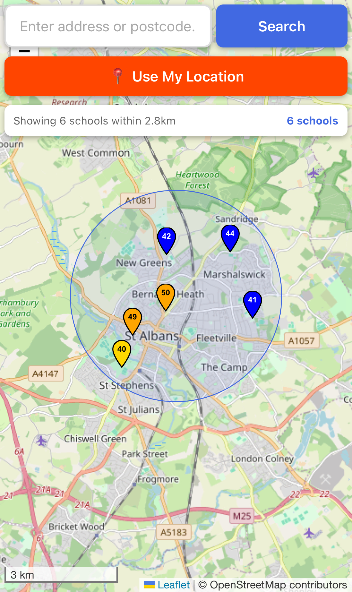
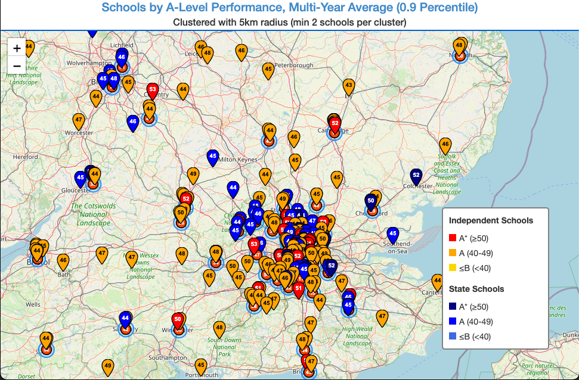

# UK Schools Finder

Interactive map tool for analyzing UK schools by A-level performance and local crime statistics. Generates a standalone web app that works on any device with no server required.

**[Live Demo: Web App →](http://web.andico.org/school_finder.html)**



**[Live Demo: Static Cluster Map →](http://web.andico.org/schools_map.html)**



---

## Quick Start

### 1. Install Dependencies

```bash
pip install pandas boto3 tqdm folium scikit-learn numpy
```

### 2. Download School Data

From https://www.compare-school-performance.service.gov.uk/download-data/:
- Select years 2021-2024
- Select "All of England" → "16-18 results (final)" → CSV format
- Gzip the files:

```bash
gzip 2021-2022_england_ks5final.csv
gzip 2022-2023_england_ks5final.csv
gzip 2023-2024_england_ks5final.csv
```

### 3. Download and Process Crime Data (Optional)

Crime data adds local safety statistics (3km radius around each school).

**Download:**
- Visit https://data.police.uk/data/
- Select "Custom download"
- Choose time period (e.g., last 12 months)
- Check "all forces" and "Include crime data"
- Download and extract the ZIP file

**Consolidate:**
```bash
python3 consolidate_crime_data.py --crime-data-dir /path/to/extracted/data
```

This script:
- Recursively finds all crime CSV files in the extracted directory
- Extracts columns: Month, Longitude, Latitude, Crime type
- Excludes outcome files (not needed for statistics)
- Combines all files into `combined_crimes.csv.gz`
- Typical output: 5-10 million crime records → ~200MB compressed file

### 4. Configure AWS

```bash
aws configure
```

Create a Place Index in Amazon Location Service and update `config.json`:

```json
{
  "geocoding": {
    "index_name": "your-place-index-name",
    "region_name": "eu-west-2"
  }
}
```

### 5. Generate Outputs

**Option A: Static map + web app**
```bash
python3 plot_schools.py              # 5-15 mins, generates schools_map.html + processed_school_data.csv
python3 create_standalone_app.py     # 5 seconds, generates school_finder.html
```

**Option B: Web app only (faster)**
```bash
python3 generate_school_data.py      # 5-15 mins, generates processed_school_data.csv
python3 create_standalone_app.py     # 5 seconds, generates school_finder.html
```

`create_standalone_app.py` reads `processed_school_data.csv` and the cache files. Optional flags:
```bash
python3 create_standalone_app.py --input processed_school_data.csv --output school_finder.html
```

### 6. View or Deploy

**Local:**
```bash
open school_finder.html
```

**Deploy to S3:**
```bash
aws s3 cp school_finder.html s3://your-bucket/index.html \
  --content-type "text/html" --acl public-read
```

---

## Architecture

### Scripts

- **`school_data_lib.py`** (~885 lines) - Shared library with all data processing functions
- **`consolidate_crime_data.py`** (~150 lines) - Consolidates downloaded crime CSV files
- **`plot_schools.py`** (~725 lines) - Generates static cluster map using Folium
- **`generate_school_data.py`** (~120 lines) - Fast data-only processing (no map)
- **`create_standalone_app.py`** (~1100 lines) - Builds standalone HTML file with embedded data

### Data Flow

```
Crime CSVs → consolidate_crime_data.py → combined_crimes.csv.gz
                                                    ↓
School CSVs → Consolidate → Filter by percentile → Geocode (AWS) → Calculate crime stats → Cache
                                                                                              ↓
                                           plot_schools.py → schools_map.html (optional)
                                           generate_school_data.py (faster, no map)
                                                              ↓
                                           processed_school_data.csv + cache files
                                                              ↓
                                           create_standalone_app.py → school_finder.html
```

### Key Features

- **Single source of truth**: All common code in `school_data_lib.py`
- **Smart caching**: Geocoding and crime data cached with SHA256 validation
- **Clean addresses**: NaN values filtered at source during geocoding
- **Fast clustering**: BallTree spatial indexing (O(n log n))
- **Standalone output**: Web app is single HTML file (~450KB)

---

## Outputs

### Static Cluster Map (`schools_map.html`)
- Desktop-focused Folium map
- Shows geographic clusters of high-performing schools
- Configurable radius: `python3 plot_schools.py --radius 10 --min-schools 3`
- Use case: Finding dense areas for home purchases

### Web App (`school_finder.html`)
- Mobile-friendly standalone HTML
- Location-based search (GPS or address)
- Dynamic radius filtering with automatic updates when scrolling map
- Adaptive crosshair/reticle that adjusts radius based on zoom level (5km max, 500m min, max 60% of screen)
- Auto-zoom to appropriate level for address searches
- Distance scale ruler for reference
- Works offline after initial load
- Use case: On-the-go school searches

---

## Configuration

Edit `config.json` to customize:

```json
{
  "filtering": {
    "percentile": 0.90,           // Top 10% of schools
    "min_age_threshold": 7         // Secondary schools only
  },
  "crime": {
    "school_crime_radius_km": 3,
    "excluded_crime_types": ["Shoplifting", "Bicycle theft", ...]
  },
  "grading": {
    "a_star_threshold": 50,        // TB3PTSE ≥50 = A* grade
    "a_threshold": 40              // TB3PTSE ≥40 = A grade
  }
}
```

**Color Coding:**
- Independent schools: Red (A*), Orange (A), Yellow (≤B)
- State schools: Navy (A*), Blue (A), Light Blue (≤B)

---

## File Structure

```
map_uk_schools/
├── school_data_lib.py             # Shared library
├── plot_schools.py                # Static map generator
├── generate_school_data.py        # Data processor
├── create_standalone_app.py       # Web app generator
├── consolidate_crime_data.py      # Crime data consolidator
├── config.json                    # Settings
│
├── 2021-2022_england_ks5final.csv.gz  # Downloaded data
├── combined_crimes.csv.gz             # Generated crime data
│
├── processed_school_data.csv      # Generated outputs
├── geocoding_cache.json
├── crime_cache.json
├── schools_map.html
└── school_finder.html
```

---

## Crime Data Processing

The `consolidate_crime_data.py` script processes raw crime data from data.police.uk into a format optimized for the school finder.

### What It Does

1. **Scans directory structure**: Recursively finds all crime CSV files
2. **Filters files**: Excludes outcome files (only crime incidents are needed)
3. **Extracts columns**: Month, Longitude, Latitude, Crime type (other columns discarded)
4. **Combines data**: Merges all files into single dataframe
5. **Compresses output**: Saves as `combined_crimes.csv.gz` (~200MB for 1 year)

### Configuration

You can configure crime processing in `config.json`:

```json
{
  "crime": {
    "crime_data_file": "combined_crimes.csv.gz",
    "source_crime_data_dir": "/path/to/extracted/data",
    "excluded_outcomes": true
  },
  "crime_processing": {
    "columns": ["Month", "Longitude", "Latitude", "Crime type"],
    "compress_output": true
  }
}
```

### Usage

**Command line:**
```bash
# Specify directory containing extracted crime data
python3 consolidate_crime_data.py --crime-data-dir ~/Downloads/police-data-2023

# Custom output file
python3 consolidate_crime_data.py --crime-data-dir ~/Downloads/police-data-2023 --output my_crimes.csv.gz
```

**Via config:**
```bash
# Add source_crime_data_dir to config.json, then run without arguments
python3 consolidate_crime_data.py
```

### Crime Statistics Used

The school finder calculates crime statistics within 3km of each school:
- **Excluded types**: Shoplifting, Bicycle theft, Anti-social behaviour, Drugs, etc.
- **Included types**: Violence, Burglary, Robbery, Vehicle crime, etc.
- **Crime index**: Percentile ranking (0-1, lower is safer)

Crime filtering is configurable via `config.json` → `crime.excluded_crime_types`.

---

## Updating Data

When new school year data is released:

```bash
gzip 2024-2025_england_ks5final.csv

# Regenerate (existing schools use cached geocoding)
python3 plot_schools.py              # or generate_school_data.py
python3 create_standalone_app.py

# Redeploy
aws s3 cp school_finder.html s3://your-bucket/index.html --acl public-read
```

---

## Technical Details

### Data Sources
- **School Performance**: UK Government (compare-school-performance.service.gov.uk)
  - TB3PTSE: Average of best 3 A-levels
  - TALLPPE_ALEV_1618: Average per A-level
- **Crime Data**: data.police.uk (3km radius, serious crimes only)

### Processing Pipeline
1. Load & consolidate multi-year CSVs
2. Calculate per-school averages across years
3. Filter by percentile (default: top 10%)
4. Clean addresses (remove NaN values)
5. Geocode with AWS Location Services (cached)
6. Calculate crime statistics (cached with SHA256 validation)
7. Save processed data and caches

### Caching
- **Geocoding**: Never invalidated (addresses don't change), saves ~$0.004/lookup
- **Crime**: Invalidated on data/config changes, ~100x speedup on hits

### Performance
- **BallTree clustering**: O(n log n) vs O(n²)
- **Vectorized haversine**: ~100x faster than loops
- **Web app**: 1-3s load time on 4G, instant client-side search

---

## AWS S3 Deployment

```bash
# Create and configure bucket
aws s3 mb s3://uk-schools-finder
aws s3 website s3://uk-schools-finder --index-document index.html

# Upload
aws s3 cp school_finder.html s3://uk-schools-finder/index.html \
  --content-type "text/html" --acl public-read

# Set bucket policy for public access
aws s3api put-bucket-policy --bucket uk-schools-finder --policy '{
  "Version": "2012-10-17",
  "Statement": [{
    "Effect": "Allow",
    "Principal": "*",
    "Action": "s3:GetObject",
    "Resource": "arn:aws:s3:::uk-schools-finder/*"
  }]
}'
```

Access at: `http://uk-schools-finder.s3-website-REGION.amazonaws.com`

**Note:** For HTTPS (required for GPS location), add CloudFront.

---

## KS2 Primary Schools Map

A parallel set of scripts (all prefixed `ks2_`) generates an equivalent interactive map for **state primary schools**, ranked by KS2 SATs results (percentage of pupils meeting the expected standard in combined reading, writing and maths).

### Key differences from the KS5 map

| | KS5 (secondary) | KS2 (primary) |
|---|---|---|
| Data portal | compare-school-performance.service.gov.uk | explore-education-statistics.service.gov.uk |
| File format | Wide CSV, one row per school per year | Long CSV, one row per school × subject × year → needs pivot |
| Address source | In the performance CSV | Separate GIAS download |
| School types | State + independent | State only (independents don't sit mandatory SATs) |
| Metric | TB3PTSE (avg best 3 A-levels) | % meeting expected standard (R+W+M combined) |
| Colour scheme | Navy/Blue/Royal Blue (state), Red/Orange/Yellow (independent) | Dark green / Green / Light green |

### 1. Download KS2 Performance Data

From [explore-education-statistics.service.gov.uk](https://explore-education-statistics.service.gov.uk/find-statistics/key-stage-2-attainment/2023-24):

- Go to **"Explore and download data"** → download the **"Key stage 2 institution level — Schools (performance)"** CSV
  - Dataset ID: `b361b4c3-21b9-46fd-9126-b8060c6a40e2` (covers 2022/23 and 2023/24)
  - Save as `ks2_school_attainment_data.csv`
- For the third year (2021/22): go to the [2021/22 release](https://explore-education-statistics.service.gov.uk/find-statistics/key-stage-2-attainment/2021-22) → **"Download all data (ZIP)"**, extract the school-level performance CSV, save as `ks2_school_attainment_2122.csv`

Or run the download script which attempts this automatically:

```bash
pip install httpx   # only extra dep needed for the downloader
python3 ks2_download_data.py
```

### 2. Download School Addresses (GIAS)

From [get-information-schools.service.gov.uk](https://get-information-schools.service.gov.uk/Downloads):

- Download **"All establishments"** → CSV
- Save as `gias_establishments.csv`

The download script also attempts this automatically.

### 3. Configure AWS (same as KS5)

Update `ks2_config.json` with your Place Index name (can reuse the same index as KS5).

### 4. Process and Generate

```bash
python3 ks2_generate_school_data.py      # 5-15 mins, generates ks2_processed_school_data.csv
python3 ks2_create_standalone_app.py     # seconds, generates ks2_school_finder.html
```

### KS2 Scripts

- **`ks2_download_data.py`** — Downloads KS2 performance data from EES and GIAS establishment list
- **`ks2_school_data_lib.py`** (~400 lines) — KS2 data processing: load long-format EES data, pivot, join GIAS, consolidate across years
- **`ks2_generate_school_data.py`** (~120 lines) — Full pipeline: load → filter → geocode → crime stats → save
- **`ks2_create_standalone_app.py`** (~800 lines) — Builds standalone `ks2_school_finder.html` with embedded data

### KS2 Configuration (`ks2_config.json`)

```json
{
  "filtering": {
    "percentile": 0.75,
    "subject": "Reading, writing and maths",
    "breakdown": "All pupils"
  },
  "grading": {
    "high_threshold": 85,
    "expected_threshold": 75
  }
}
```

**Colour coding** (all state schools):
- Dark green: ≥85% meeting expected standard
- Green: ≥75%
- Light green: above selected percentile threshold but <75%

### KS2 Data Flow

```
EES KS2 CSVs (long format) ─────────────────────────────────────────────────────┐
                                                                                 │
GIAS establishments CSV ────┐                                                    │
                            ↓                                                    ↓
                     ks2_school_data_lib.py: pivot + join + consolidate across years
                                                    ↓
                      Filter by percentile → Geocode (AWS) → Crime stats → Cache
                                                    ↓
                              ks2_generate_school_data.py → ks2_processed_school_data.csv
                                                    ↓
                              ks2_create_standalone_app.py → ks2_school_finder.html
```

### KS2 File Structure

```
map_uk_schools/
├── ks2_config.json                    # KS2 settings
├── ks2_download_data.py               # Data downloader
├── ks2_school_data_lib.py             # KS2 processing library
├── ks2_generate_school_data.py        # Pipeline script
├── ks2_create_standalone_app.py       # Web app generator
│
├── ks2_school_attainment_data.csv     # Downloaded from EES (2022/23–2023/24)
├── ks2_school_attainment_2122.csv     # Downloaded from EES (2021/22)
├── gias_establishments.csv            # Downloaded from GIAS
│
├── ks2_processed_school_data.csv      # Generated output
├── ks2_geocoding_cache.json
├── ks2_crime_cache.json
└── ks2_school_finder.html
```

---

## License

- School data: UK Government Open Data License
- Crime data: data.police.uk Open Data License
- Map tiles: © OpenStreetMap contributors
- Code: MIT License
